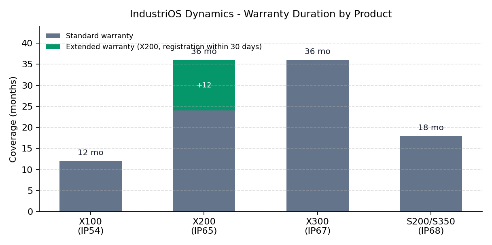

# X200 Industrial Controller — User Manual

**Document ID:** DOC-X200-UM-001 | **Revision:** 5.1 | **Effective date:** 2024-04-02 | **Classification:** Customer

**Manufacturer:** IndustriOS Dynamics Ltd., Vondelingenweg 601, 3196 KK Rotterdam, The Netherlands
**Support:** support@industrios-dynamics.com | +31 10 555 0142 | Mon-Fri 08:00-17:00 CET

## 1. Product Overview

The X200 is the mid-range X-Series controller for multi-axis material handling, filling and bottling lines, and retrofit programs. It doubles the I/O budget of the X100 with 24 digital inputs and 16 relay outputs, and widens environmental tolerance to IP65 and -20 °C to +60 °C, which permits installation near wash-down zones and in unheated plant rooms.

The X200 standard warranty is 24 months from the delivery date. Registering the device within 30 days of purchase extends the warranty to 36 months at no additional cost. Registration takes place in the IndustriOS Customer Portal: enter the serial number (format IOS-XX-NNNNNN) and the delivery date printed on the invoice; confirmation arrives by e-mail within two working days. Devices registered on day 31 or later remain covered for the standard 24 months only — the 30-day window is enforced without exceptions.

## 2. Technical Specifications

| Parameter | Value |
|---|---|
| Part number | X200-48D-16R |
| Supply voltage | 48 VDC +/- 10% (43.2-52.8 VDC) |
| Processor | ARM Cortex-A72 quad-core @ 1.5 GHz |
| Memory | 4 GB DDR4 RAM, 32 GB eMMC flash |
| Digital inputs | 24 channels, 24 VDC sink/source, configurable 0.5/3.5/10 ms filter |
| Relay outputs | 16 channels, SPDT, 250 VAC / 30 VDC, 6 A per channel |
| Protection rating | IP65 (front face and sealed housing) |
| Operating temperature | -20 °C to +60 °C, non-condensing |
| Storage temperature | -30 °C to +75 °C |
| Relative humidity | 5-95% RH, non-condensing |
| Communication | 2x Gigabit Ethernet (MODBUS-TCP, OPC-UA), RS-485 (MODBUS-RTU), CAN 2.0B |
| Expansion | 2x X-EBS bus ports, up to 64 additional I/O channels |
| Dimensions / weight | 160 x 120 x 85 mm, 980 g |
| Power consumption | 18 W typical, 24 W maximum |
| Standard warranty | 24 months, extendable to 36 months with 30-day registration |

## 3. Firmware Requirements

Install firmware v3.2.1 (released 2024-03-15) or later before commissioning. This release fixes the MODBUS-TCP timeout bug tracked as issue IOD-4471, in which idle server connections were silently dropped after 3-4 hours and produced SCADA polling gaps. Firmware v3.2.0 and earlier must not be used in MODBUS-TCP-critical installations. Always create a full project and parameter backup before updating firmware (see DOC-MNT-SC-003); the update itself takes about 8 minutes and reboots the controller twice.

## 4. Mechanical and Electrical Installation

Mount on a 35 mm DIN rail (EN 60715) with at least 100 mm clearance on all sides. The IP65 rating depends on the front gasket being correctly seated; inspect the gasket whenever the cover is removed and replace it after five opening cycles. Terminal torque is 0.6-0.8 Nm with 0.25-2.5 mm2 ferrules.

The 48 VDC supply must be a SELV/PELV circuit per EN 61010-1. Inrush current at power-up is 1.9 A for 50 ms; protect the feed with a 2 A slow-blow fuse. Relay contacts are rated for 100,000 mechanical cycles at rated load; apply RC snubbers (47 ohm / 100 nF) on inductive loads as on the X100. Separate signal wiring from motor and VFD cables by at least 300 mm to avoid EMC-induced input glitches.

## 5. Commissioning

1. Confirm supply voltage 43.2-52.8 VDC and protective-earth continuity below 0.1 ohm.
2. Connect via the USB-C service port (laptop link-local address 169.254.0.10/16) and Device Console 3.1 or later.
3. Set the static control-network IP and VLAN tag (default VLAN 10) per DOC-NET-IG-003.
4. Flash firmware v3.2.1 or later and restore the project backup.
5. Run the 24-input point-to-point test and the 16-output forced test.
6. Verify MODBUS-TCP connectivity on port 502 from the SCADA host and OPC-UA on port 4840.
7. Register the device in the Customer Portal for the warranty extension and file the Deployment Checklist (DOC-DEP-CL-004).

## 6. Warranty Summary

| Coverage | Duration | Condition |
|---|---|---|
| Standard warranty | 24 months from delivery | Automatic |
| Extended warranty | 36 months from delivery | Registration within 30 days of purchase |
| Out-of-warranty repair | Quoted per repair | Evaluation free of charge |

Full terms, exclusions, and the RMA process appear in the Warranty Policy (DOC-WAR-POL-001). Water damage on non-IP68 equipment is excluded; although the X200 is IP65, immersion and high-pressure jets aimed at the gasket are not covered.

## 7. Related Documents

- Warranty Policy (DOC-WAR-POL-001)
- Network Integration Guide (DOC-NET-IG-003)
- Troubleshooting Guide (DOC-TSH-FC-006)
- Firmware Release Notes (DOC-FW-RN-005)
